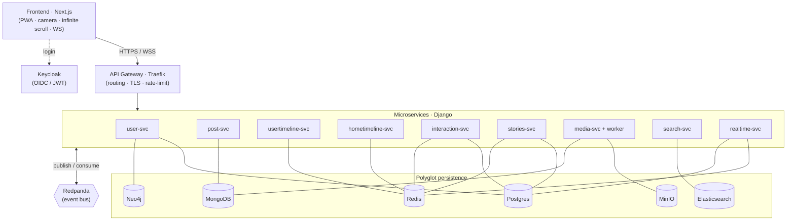

<div align="center">

# 📸 TinyInsta

### An Instagram-like clone, designed as a real distributed system.

*Feed · Stories · Likes · Comments · Search · Photo/video upload · Infinite scroll · Real-time*

<br/>

[](https://github.com/akc0r/TinyInsta/actions/workflows/ci.yml)


<br/>


</div>

---

> **The pitch.** TinyInsta is not "yet another Instagram clone". It is a playground to build — and demonstrate — an **event-driven microservices** architecture with **polyglot persistence**: each database is chosen for what it does best, and services communicate through asynchronous events rather than direct coupling.

> **Status — feature complete.** All planned capabilities are delivered: 9 Django microservices over 6 datastores, a Next.js PWA, an asynchronous media pipeline, real-time WebSocket, search & explore, an observability stack, a Kubernetes overlay, and CI. The optional Capacitor mobile build and the Java/Spring service swap are intentionally out of scope.

## ✨ What makes this project interesting

- **Event-driven microservices** — 9 decoupled Django services communicating over a Kafka-style bus (Redpanda). No fragile direct calls: events.
- **Polyglot persistence** — Postgres (integrity), MongoDB (documents), **Neo4j (social graph)**, Elasticsearch (search), Redis (feed & real-time), MinIO (blobs). The right tool for each problem.
- **Deliberate CQRS** — the feed (Redis) and the search index (Elasticsearch) are rebuildable *read models* derived from events. System of record ≠ read views.
- **The feed problem, for real** — fan-out on write, Redis cache, cursor pagination, and the **hybrid fan-out** that solves the celebrity / hot-user problem at read time.
- **Real-time** — likes, counters, and stories propagating live over WebSocket.
- **Production-minded ops** — correlated JSON logs (`correlation_id` across HTTP + bus), Prometheus/Grafana + Filebeat/Kibana dashboards, Traefik rate limiting, a caching CDN in front of MinIO, a Kubernetes (kustomize) overlay, and a GitHub Actions CI pipeline.

## 🏗️ Architecture at a glance



➡️ Full detail: **[docs/ARCHITECTURE.md](docs/ARCHITECTURE.md)**

## 🧱 Tech stack

| Layer | Choice | Detail |
|---|---|---|
| Frontend | **Next.js 16 / React 19** | PWA: web camera, infinite scroll, WebSocket client — *([details](docs/FRONTEND.md))* |
| Backend | **Django / DRF** | One service per bounded context |
| Auth | **Keycloak** | OIDC, JWTs validated by services (JWKS) |
| Bus | **Redpanda** | Kafka API, one binary |
| Gateway | **Traefik** | Routing, TLS, rate-limit, forward-auth |
| Storage | **MinIO** | S3-compatible, upload via presigned URL, reads served through a caching CDN |
| Data | **Postgres · MongoDB · Neo4j · Elasticsearch · Redis** | [Why each →](docs/DATA-STORES.md) |
| Observability | **Prometheus · Grafana · Filebeat · Kibana** | Metrics + correlated JSON logs (`correlation_id` across HTTP & bus) |
| Orchestration | **Docker Compose · Kubernetes** | Compose for local; a kustomize overlay mirrors the same topology |
| CI | **GitHub Actions** | Lint (ruff + frontend) and a matrix build of every service image |

## 📁 Repository layout

```
tinyinsta/
├── frontend/                 # Next.js
├── services/
│   ├── user-svc/             # profiles + social graph (Postgres + Neo4j)
│   ├── post-svc/             # posts + comments (MongoDB)
│   ├── usertimeline-svc/     # an author's posts / profile (Redis)
│   ├── hometimeline-svc/     # home feed + fan-out (Redis)
│   ├── interaction-svc/      # likes + counters (Postgres + Redis)
│   ├── stories-svc/          # ephemeral stories (Postgres + Redis)
│   ├── media-svc/            # uploads (MinIO + MongoDB) + media-worker (transcode)
│   ├── search-svc/           # search & explore (Elasticsearch)
│   └── realtime-svc/         # WebSocket + notifications
├── libs/                     # shared: auth_jwt, bus client, event schemas, Django base
├── infra/                    # postgres init, traefik, keycloak realm, redpanda
└── docs/                     # 📚 this documentation
```

## 🚀 Quick start

```bash
git clone <repo> tinyinsta && cd tinyinsta
cp .env.example .env
make infra          # Postgres, Redis, Keycloak, Redpanda, Traefik
make up             # everything: datastores + all application services
make ps             # check status
# Frontend
make front          # cd frontend && pnpm install && pnpm dev
```

Then: frontend on `http://localhost:3000`, API via Traefik on `http://localhost/api`, Keycloak console on `http://localhost:8080`, MinIO console on `http://localhost:9001`, Traefik dashboard on `http://localhost:8090`.

> ⚙️ Datastores are gated by Docker Compose **profiles**, so you can bring up subsets rather than all seven at once (`make infra`, or `docker compose --profile infra --profile mongo up -d`).

> 🧠 **Resources.** The full stack (7 datastores incl. Cassandra/Elasticsearch/Neo4j + a dozen services) is memory-hungry — give **Docker Desktop ≥ 8 GB** of RAM. The JVM stores have bounded heaps + `mem_limit`, and HTTP services default to a single gunicorn worker (`WEB_CONCURRENCY`), to fit a laptop; raise both with more RAM.

> 🗄️ **Migrations run automatically.** Each relational service has a one-shot `*-migrate` container that applies Django migrations before the service starts — no manual `migrate` step.

## 📚 Documentation

| Doc | Content |
|---|---|
| [ARCHITECTURE.md](docs/ARCHITECTURE.md) | Overview, sync/async flows, CQRS, fan-out, decisions |
| [DATA-STORES.md](docs/DATA-STORES.md) | Polyglot persistence: why each database |
| [EVENTS.md](docs/EVENTS.md) | Bus contract: catalog, envelope, conventions |
| [FRONTEND.md](docs/FRONTEND.md) | Frontend stack, camera flow, real-time, auth |
| [services/](services/README.md) | One spec file per microservice |

## ✅ Capabilities

The system was built in deliberate increments, each adding one end-to-end capability. All are delivered:

| Capability | What it demonstrates |
|---|---|
| Foundations | Frontend → `/api/health` through Traefik, Keycloak up |
| Auth + Profiles | OIDC login, profile editing |
| Posts + Upload | Upload a photo → visible on the profile |
| Social graph | Follow + "friends of friends" suggestions (Neo4j) |
| **Home timeline + fan-out** ⭐ | Follow → post → home feed, infinite scroll |
| Live interactions | Like → live counter on another device |
| Stories | Story from the camera, expires after 24h |
| Search & explore | User/hashtag search + explore page (Elasticsearch) |
| Async media | Video → thumbnail + 720p transcode automatically |
| Notifications + observability | Notification center + metrics/logs dashboards |
| Scale & ops | Hybrid fan-out for celebrities, Kubernetes overlay, CDN, CI |

## 🎯 Scope

TinyInsta reproduces the **architecture and patterns** of a large social network, **not its scale**: no multi-region, no edge CDN, no geographic sharding, no two billion users. This separation is deliberate — distinguishing *design* from *scaling* is part of the point.

---

<div align="center">
<sub>Built as a distributed-architecture project — design over scale, patterns over product.</sub>
</div>
