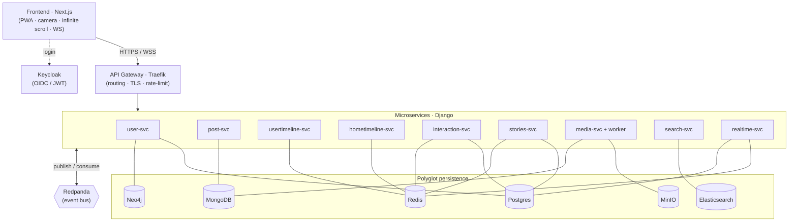

<div align="center">

# 📸 TinyInsta

### An Instagram-like clone, designed as a real distributed system.

*Feed · Stories · Likes · Comments · Search · Photo/video upload · Infinite scroll · Real-time*

<br/>


</div>

---

> **The pitch.** TinyInsta is not "yet another Instagram clone". It is a playground to build — and demonstrate — an **event-driven microservices** architecture with **polyglot persistence**: each database is chosen for what it does best, and services communicate through asynchronous events rather than direct coupling.
>
> *Codename "TinyInsta" — rename freely.*

## ✨ What makes this project interesting

- **Event-driven microservices** — decoupled Django services communicating over a Kafka-style bus (Redpanda). No fragile direct calls: events.
- **Polyglot persistence** — Postgres (integrity), MongoDB (documents), **Neo4j (social graph)**, Elasticsearch (search), Redis (feed & real-time). The right tool for each problem.
- **Deliberate CQRS** — the feed (Redis) and the search index (Elasticsearch) are rebuildable *read models* derived from events. System of record ≠ read views.
- **The feed problem, for real** — fan-out on write, Redis cache, cursor pagination, and handling the "celebrity problem".
- **Real-time** — likes, counters, and stories propagating live over WebSocket.

## 🏗️ Architecture at a glance



➡️ Full detail: **[docs/ARCHITECTURE.md](docs/ARCHITECTURE.md)**

## 🧱 Tech stack

| Layer | Choice | Detail |
|---|---|---|
| Frontend | **Next.js (React)** | PWA, web camera, infinite scroll, WebSocket client — *([Angular alternative](docs/FRONTEND.md))* |
| Backend | **Django / DRF** | One service per bounded context |
| Auth | **Keycloak** | OIDC, JWTs validated by services (JWKS) |
| Bus | **Redpanda** | Kafka API, one binary |
| Gateway | **Traefik** | Routing, TLS, rate-limit, forward-auth |
| Storage | **MinIO** | S3-compatible, upload via presigned URL |
| Data | **Postgres · MongoDB · Neo4j · Elasticsearch · Redis** | [Why each →](docs/DATA-STORES.md) |
| Orchestration | **Docker Compose** | Everything local; K8s considered at the end |

## 📁 Repository layout

```
tinyinsta/
├── frontend/                 # Next.js
├── services/
│   ├── user-svc/             # profiles + social graph (Postgres + Neo4j)
│   ├── post-svc/             # posts + comments (MongoDB)
│   ├── usertimeline-svc/     # an author's posts / profile (Redis)
│   ├── hometimeline-svc/     # home feed + fan-out (Redis)
│   ├── interaction-svc/      # likes + counters (Postgres + Redis)
│   ├── stories-svc/          # ephemeral stories (Postgres + Redis)
│   ├── media-svc/            # uploads (MinIO + MongoDB) + media-worker (transcode)
│   ├── search-svc/           # search & explore (Elasticsearch)
│   └── realtime-svc/         # WebSocket + notifications
├── libs/                     # shared: auth_jwt, bus client, event schemas, Django base
├── infra/                    # postgres init, traefik, keycloak realm, redpanda
└── docs/                     # 📚 this documentation
```

## 🚀 Quick start

```bash
git clone <repo> tinyinsta && cd tinyinsta
cp .env.example .env
make infra          # Postgres, Redis, Keycloak, Redpanda, Traefik
make up             # everything: datastores + all application services
make ps             # check status
# Frontend
make front          # cd frontend && pnpm install && pnpm dev
```

Then: frontend on `http://localhost:3000`, API via Traefik on `http://localhost/api`, Keycloak console on `http://localhost:8080`, MinIO console on `http://localhost:9001`, Traefik dashboard on `http://localhost:8090`.

> ⚙️ Datastores come online **incrementally** through the phases (see roadmap) — you don't light up all six on day one. Docker Compose **profiles** let you start subsets (`make infra`, or `docker compose --profile infra --profile mongo up -d`).

## 📚 Documentation

| Doc | Content |
|---|---|
| [ARCHITECTURE.md](docs/ARCHITECTURE.md) | Overview, sync/async flows, CQRS, fan-out, decisions |
| [DATA-STORES.md](docs/DATA-STORES.md) | Polyglot persistence: why each database |
| [EVENTS.md](docs/EVENTS.md) | Bus contract: catalog, envelope, conventions |
| [ROADMAP.md](docs/ROADMAP.md) | Phased roadmap, one demonstrable deliverable per phase |
| [FRONTEND.md](docs/FRONTEND.md) | Frontend stack, camera flow, real-time, auth |
| [services/](services/README.md) | One spec file per microservice |

## 🗺️ Roadmap (summary)

| Phase | Demonstrable deliverable |
|---|---|
| 0 · Foundations | Frontend → `/api/health` via Traefik, Keycloak up |
| 1 · Auth + Profiles | OIDC login, profile editing |
| 2 · Posts + Upload | Upload a photo → visible on the profile |
| 3 · Social graph | Follow + "friends of friends" suggestions (Neo4j) |
| **4 · Home timeline + fan-out** | **MVP: follow → post → home feed, infinite scroll** ⭐ |
| 5 · Live interactions | Like → live counter on another device |
| 6 · Stories | Story from the camera, expires after 24h |
| 7 · Search | User/hashtag search + explore page (Elasticsearch) |
| 8 · Async media | Video → thumbnail + 720p transcode automatically |
| 9 · Notifications + observability | Notification center + dashboards |
| 10 · Scale & ops *(optional)* | Hybrid fan-out, K8s, CI/CD |

➡️ Detail: **[docs/ROADMAP.md](docs/ROADMAP.md)**

## 🎯 Conscious scope

TinyInsta reproduces the **architecture and patterns** of a large social network, **not its scale**: no multi-region, no edge CDN, no geographic sharding, no two billion users. This choice is deliberate and documented — telling *design* apart from *scaling* is part of the point.

---

<div align="center">
<sub>Built as a distributed-architecture learning project — README-driven.</sub>
</div>
