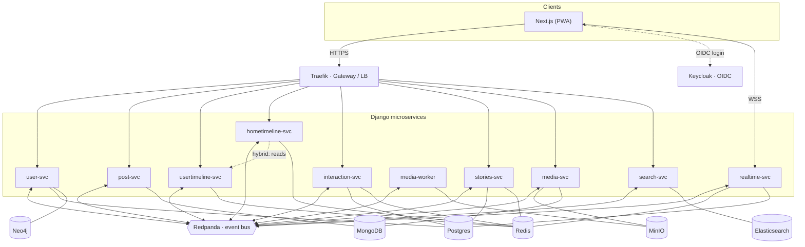

# Architecture

## Context & goals

TinyInsta is an Instagram-like clone built as a **realistic distributed system**. The goal is not scale (it does not target two billion users) but a faithful demonstration of the **patterns**: decomposition into microservices, event-driven communication, polyglot persistence, CQRS, and solving the feed-generation problem.

Design constraints:
- **Incremental delivery** → the system was built in increments, each adding one demonstrable end-to-end capability and one datastore at a time.
- **Single backend language (Django)** → complexity is concentrated in the architecture and the datastores, not in a proliferation of runtimes.
- **Frontend in Next.js** → a focused PWA client; the architectural weight sits in the backend.

## Overview

## Two communication modes

### 1. Synchronous (HTTP, via Traefik)
For user-initiated requests: reading the feed, creating a post, liking. The frontend talks to Traefik, which routes to the right service. Each service validates the Keycloak JWT.

### 2. Asynchronous (events, via Redpanda)
For propagating side effects between services. When `post-svc` creates a post, it does not call the timelines directly: it **publishes `post.created`**, and `hometimeline-svc`, `usertimeline-svc`, and `search-svc` each react at their own pace. This decoupling is what creates resilience: a service can go down, catch up on restart, and scale independently.

➡️ Full bus contract: [EVENTS.md](EVENTS.md)

## Golden rule

> **A service never reads another service's database.** Any data from another domain is obtained either by API call (sync) or by event (async, with optional denormalization). This is what guarantees the services stay truly independent.

## CQRS & read models

Two components are derived **read views**, not systems of record:

| Read model | Built from | System of record |
|---|---|---|
| User timeline (Redis, per author) | `post.created`, `post.deleted` | post-svc (MongoDB) |
| Home timeline (Redis, per follower) | `post.created`, `user.followed` | post-svc (MongoDB) |
| Search index (Elasticsearch) | `user.created`, `post.created` | user-svc / post-svc |
| Ranking signals (Redis, ranking-svc) | `post.created/liked/commented/deleted` | post-svc / interaction-svc |

Practical consequence: these views are **rebuildable**. If the Elasticsearch index is corrupted, rebuild it by replaying the events. This is deliberate CQRS — separating the write model (normalized, consistent) from the read models (denormalized, optimized for display).

## Timelines: fan-out (the heart of the project)

The central problem of a social network: how to generate timelines? TinyInsta distinguishes two, like Twitter:

- **user timeline** (`usertimeline-svc`) — all posts by **one** author (their profile grid). "Fan-out to self": one post = one entry. No explosion.
- **home timeline** (`hometimeline-svc`) — the posts **for** a follower, aggregated from every account they follow. This is the genuinely expensive fan-out problem.

Strategies for the **home timeline**:

- **Fan-out on write (push)** — *the default.* On `post.created`, `hometimeline-svc` pushes the post id into each follower's home timeline: a **Redis Sorted Set** `home:{user_id}` (score = timestamp). Ultra-fast reads (paginated sorted set). Expensive writes when the author has many followers.
- **Fan-out on read (pull)** — computed at read time. Free writes, expensive reads.
- **Hybrid** — push for normal accounts; for "celebrities" (> N followers), no fan-out on write: at read time, `hometimeline-svc` **merges** `home:{follower}` with the `usertimeline:{celeb}` lists read from `usertimeline-svc`. This is where the home timeline **reads the user timelines** — the authentic Twitter architecture for the *hot-user problem*.

**Infinite scroll:** **keyset cursor** pagination `(timestamp, post_id)`, never `OFFSET` (which degrades and duplicates under concurrent inserts). `GET /home?cursor=&limit=20` → items + `next_cursor`.

**Algorithmic re-rank (optional).** With `RANKING_ENABLED`, hometimeline-svc posts each page's
candidate ids to **ranking-svc**, which scores them by recency ⊕ engagement ⊕ viewer↔author
affinity (Redis signals derived from `post.*` events) and returns an order applied *within* the
page — keyset pagination stays chronological. If ranking-svc is disabled or unreachable the feed
falls back to pure chronological order, so ranking is an enhancement, never a hard dependency.

**Direct messages.** messaging-svc owns DM persistence on **Cassandra** (the write-heavy,
time-ordered, partition-by-conversation workload); it emits `message.sent`, and realtime-svc — the
WebSocket hub — delivers it live to the recipient. Send is HTTP (client→server), receive is WS.

## Authentication

Keycloak (OIDC) is the identity authority. Flow:
1. The frontend runs Authorization Code + PKCE → Keycloak → JWT.
2. The JWT is sent in `Authorization: Bearer` to Traefik.
3. Each service validates the signature against Keycloak's **JWKS** via the shared `libs/auth_jwt` library.

Validation happens at the service level (each service trusts only Keycloak's JWKS); centralizing it at Traefik via forward-auth is a possible future refinement.

## Key decisions & trade-offs

| Decision | Choice | Trade-off |
|---|---|---|
| Backend language | Django only | Simplicity over polyglot runtimes; complexity is reserved for the architecture and the data stores. (A Java/Spring service swap remains possible.) |
| Bus | Redpanda (Kafka API) | Same API and clients as Kafka, one binary instead of a JVM cluster. |
| Data | Polyglot persistence | Each store for its strength — see [DATA-STORES.md](DATA-STORES.md). |
| A service's data | Dedicated schema/instance | No coupling through the database; integration only via API/events. |
| Timelines | Split home / user, fan-out on write + Redis | The canonical Twitter split; the user timeline is the read building block for the home timeline in hybrid mode. Fast reads, with write cost on hot accounts absorbed by the hybrid path. |
| Pagination | Keyset cursor | Stable and performant under load, unlike OFFSET. |
| Event delivery | At-least-once + idempotency | "Exactly-once" does not exist in distributed systems. |
| Frontend | Next.js | A focused PWA client, keeping the architectural weight in the backend. |

## Out of scope (by design)

Multi-region, real edge CDN, geographic sharding, 2B users, sharded MongoDB. TinyInsta implements the architecture and the patterns, **not the scale**.

## Distributed-systems pitfalls to keep in mind

- No distributed transaction: post + fan-out are not atomic → eventual consistency.
- Idempotency is mandatory (at-least-once delivery): dedupe by `event_id`.
- No cross-service JOIN: denormalize in the event, or call the owning service.
- Message ordering is guaranteed **only within a partition**, never across topics.
