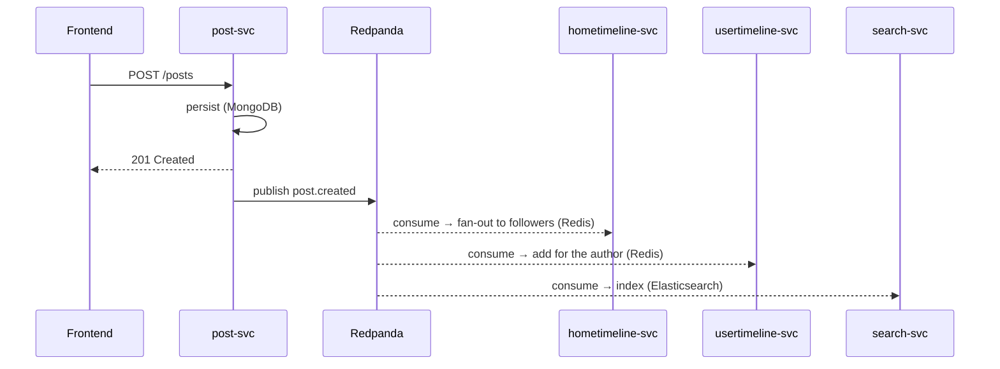

# Events — the bus contract

TinyInsta is **event-driven**: services do not call each other directly to propagate side effects, they publish events on **Redpanda** (Kafka API) that others consume. This file is the **contract** — to be frozen early, because it is what guarantees the decoupling.

## Catalog

| Event | Emitted by | Consumed by | Key data |
|---|---|---|---|
| `user.created` | user-svc | search-svc, realtime-svc | `user_id, username` |
| `user.followed` | user-svc | hometimeline-svc (back-fill), stories-svc (following graph), realtime-svc | `follower_id, followee_id` |
| `user.unfollowed` | user-svc | hometimeline-svc, stories-svc | `follower_id, followee_id` |
| `user.blocked` | user-svc | — (also emits `user.unfollowed` for severed edges) | `blocker_id, blocked_id` |
| `user.unblocked` | user-svc | — | `blocker_id, blocked_id` |
| `user.close_friend_added` | user-svc | stories-svc (close-friends graph) | `owner_id, friend_id` |
| `user.close_friend_removed` | user-svc | stories-svc | `owner_id, friend_id` |
| `user.mentioned` | post-svc | realtime-svc (resolves username→id, notifies) | `username, actor_id, source_type, source_id, post_id` |
| `post.created` | post-svc | hometimeline-svc (fan-out), usertimeline-svc, search-svc, ranking-svc | `post_id, author_id, created_at, kind` |
| `post.commented` | post-svc | realtime-svc, ranking-svc | `post_id, comment_id, author_id, post_author_id, body` |
| `post.comment_edited` | post-svc | — | `post_id, comment_id, author_id, body` |
| `post.comment_deleted` | post-svc | — | `post_id, comment_id, author_id` |
| `post.deleted` | post-svc | hometimeline-svc, usertimeline-svc, search-svc, ranking-svc | `post_id` |
| `post.liked` | interaction-svc | realtime-svc, ranking-svc | `post_id, user_id, new_count` |
| `post.unliked` | interaction-svc | realtime-svc, ranking-svc | `post_id, user_id, new_count` |
| `post.saved` | post-svc | — (counters/analytics hook) | `post_id, user_id, collection` |
| `post.unsaved` | post-svc | — | `post_id, user_id, collection` |
| `post.reposted` | post-svc | hometimeline-svc, usertimeline-svc, realtime-svc | `repost_id, post_id, user_id, author_id` |
| `post.unreposted` | post-svc | hometimeline-svc, usertimeline-svc | `repost_id, post_id, user_id` |
| `media.uploaded` | media-svc | media-worker | `media_id, kind, original_url` |
| `media.processed` | media-worker | post-svc | `media_id, variants` |
| `story.created` | stories-svc | realtime-svc | `story_id, author_id` |
| `story.viewed` | stories-svc | — | `story_id, viewer_id` |
| `message.sent` | messaging-svc | realtime-svc (live delivery) | `message_id, conversation_id, sender_id, recipient_id, body` |

> Posts are emitted **via a transactional outbox** in post-svc: the Mongo write
> and the outbox row commit in one transaction, and a relay
> (`manage.py outbox_relay`) publishes them — so a post is never visible without
> its fan-out event (no dual-write loss). See `services/post-svc`.

## Standard envelope

Every message follows a common envelope:

```json
{
  "event_id": "uuid-v4",
  "type": "post.created",
  "occurred_at": "2026-06-23T21:00:00Z",
  "version": 1,
  "correlation_id": "hex-trace-id",
  "data": { "post_id": "...", "author_id": "...", "created_at": "..." }
}
```

- `event_id`: unique identifier → used for **deduplication** on the consumer side.
- `version`: schema versioning → lets payloads evolve without breaking consumers.
- `correlation_id`: the originating request's trace id, set by the producer from
  the ambient context and re-bound by each consumer → one user action is
  traceable across services in the JSON logs (see `tinyinsta.observability`).

## Conventions

- **One topic per event type** (`post.created`, `post.liked`…). Simple to start with.
- **One consumer group per service**: each consuming service has its own group → independent offsets, ack, replay, and multiple instances.
- **At-least-once delivery**: a message may be received more than once → every consumer **must be idempotent**. The shared consumer dedupes by `event_id` against a durable, cross-replica `RedisDedupeStore` (Redis key per processed `event_id`, see `DEDUPE_REDIS_URL`), so a redelivery after a restart or across instances is skipped.
- **Bounded retry + dead-letter**: when a handler raises, the consumer retries in-process with exponential backoff (`BUS_MAX_ATTEMPTS`, `BUS_RETRY_BACKOFF`). On exhaustion the original message is routed to a per-group dead-letter topic `dlq.<group_id>` (original bytes preserved, failure metadata in headers) and the offset is committed so one poison message can't stall the partition. A dead-lettered message is **not** marked processed, so a deliberate replay runs again. If the DLQ itself is unreachable the offset is left uncommitted (redelivered later) rather than lost.
- **Ordering guaranteed within a partition only**: never assume ordering across different topics. If per-entity ordering matters, partition by that entity (e.g. key = `author_id`).
- **Contract validation (Schema Registry, in-process).** Every event type maps to a
  payload dataclass in `libs/tinyinsta/events/registry.py`. The producer validates a
  payload against its schema **before** it goes on the wire (`BUS_VALIDATE=0` to
  disable for a deliberate malformed-event test), so a contract breach fails at the
  source instead of corrupting a downstream read model. CI runs
  `registry.assert_complete()` as a build-time gate: a new event type without a
  registered schema (or vice versa) breaks the build. The **Avro upgrade** is a drop-in
  evolution of this module — register the same schemas in a Confluent/Redpanda Schema
  Registry and serialise the `data` block as Avro instead of JSON; the contract source
  of truth stays in `registry.py` either way.

## Python client

`confluent-kafka` (Redpanda-compatible). A shared `libs/bus` library exposes a producer (serializes the envelope) and a consumer (loop + ack + dedupe + bounded retry + dead-letter), so the plumbing is not rewritten in each service.

## Example flow: creating a post



The frontend gets its response immediately; fan-out and indexing happen **in the background**, without blocking the user.
