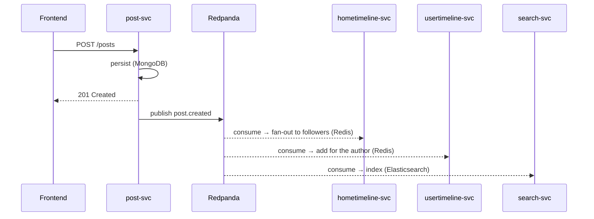

# Events — the bus contract

TinyInsta is **event-driven**: services do not call each other directly to propagate side effects, they publish events on **Redpanda** (Kafka API) that others consume. This file is the **contract** — to be frozen early, because it is what guarantees the decoupling.

## Catalog

| Event | Emitted by | Consumed by | Key data |
|---|---|---|---|
| `user.created` | user-svc | search-svc, realtime-svc | `user_id, username` |
| `user.followed` | user-svc | hometimeline-svc (back-fill), stories-svc (following graph), realtime-svc | `follower_id, followee_id` |
| `user.unfollowed` | user-svc | hometimeline-svc, stories-svc | `follower_id, followee_id` |
| `user.blocked` | user-svc | — (also emits `user.unfollowed` for severed edges) | `blocker_id, blocked_id` |
| `user.unblocked` | user-svc | — | `blocker_id, blocked_id` |
| `user.close_friend_added` | user-svc | stories-svc (close-friends graph) | `owner_id, friend_id` |
| `user.close_friend_removed` | user-svc | stories-svc | `owner_id, friend_id` |
| `post.created` | post-svc | hometimeline-svc (fan-out), usertimeline-svc, search-svc | `post_id, author_id, created_at` |
| `post.commented` | post-svc | realtime-svc | `post_id, comment_id, author_id, post_author_id, body` |
| `post.deleted` | post-svc | hometimeline-svc, usertimeline-svc, search-svc | `post_id` |
| `post.liked` | interaction-svc | realtime-svc | `post_id, user_id, new_count` |
| `post.unliked` | interaction-svc | realtime-svc | `post_id, user_id, new_count` |
| `media.uploaded` | media-svc | media-worker | `media_id, kind, original_url` |
| `media.processed` | media-worker | post-svc | `media_id, variants` |
| `story.created` | stories-svc | realtime-svc | `story_id, author_id` |
| `story.viewed` | stories-svc | — | `story_id, viewer_id` |

## Standard envelope

Every message follows a common envelope:

```json
{
  "event_id": "uuid-v4",
  "type": "post.created",
  "occurred_at": "2026-06-23T21:00:00Z",
  "version": 1,
  "data": { "post_id": "...", "author_id": "...", "created_at": "..." }
}
```

- `event_id`: unique identifier → used for **deduplication** on the consumer side.
- `version`: schema versioning → lets payloads evolve without breaking consumers.

## Conventions

- **One topic per event type** (`post.created`, `post.liked`…). Simple to start with.
- **One consumer group per service**: each consuming service has its own group → independent offsets, ack, replay, and multiple instances.
- **At-least-once delivery**: a message may be received more than once → every consumer **must be idempotent** (dedupe by `event_id`, e.g. a table/Redis key of already-processed `event_id`s).
- **Ordering guaranteed within a partition only**: never assume ordering across different topics. If per-entity ordering matters, partition by that entity (e.g. key = `author_id`).
- **Schemas frozen early**; Avro + Schema Registry is an option later to validate contracts at build time.

## Python client

`confluent-kafka` (Redpanda-compatible). A shared `libs/bus` library exposes a producer (serializes the envelope) and a consumer (loop + ack + dedupe), so the plumbing is not rewritten in each service.

## Example flow: creating a post



The frontend gets its response immediately; fan-out and indexing happen **in the background**, without blocking the user.
