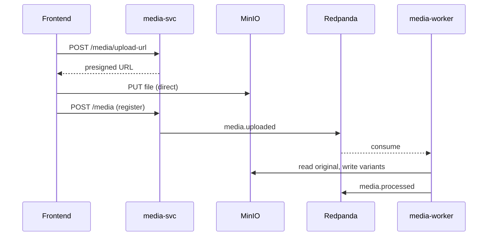

# media-svc + media-worker

> Media uploads and asynchronous processing (thumbnails, transcode).

| | |
|---|---|
| **Language** | Django (svc) + Python worker |
| **Stores** | MinIO (binaries) + MongoDB (metadata) |
| **Sync dependencies** | none |
| **Authentication** | Keycloak JWT (JWKS) |

## media-svc — reception

### Responsibilities
- Issue a **presigned URL** for direct client → MinIO upload.
- Record media metadata.

### Data model (lightweight MongoDB)
```json
media: {
  "_id": "UUID",
  "owner_id": "UUID",
  "kind": "image | video",
  "status": "pending | ready",
  "original_url": "string",
  "variants": { "thumb": "url", "720p": "url" },
  "created_at": "date"
}
```

> Metadata is light and schema-flexible (the `variants` map grows as the worker produces outputs), which fits a document store. Postgres with a JSONB column would be an equally valid choice.

### REST API
| Method | Route | Description |
|---|---|---|
| `POST` | `/media/upload-url` | Get a presigned MinIO URL |
| `POST` | `/media` | Register the uploaded media (status `pending`) |
| `GET` | `/media/{id}` | Metadata + variants |

### Events
**Emits:** `media.uploaded`

## media-worker — processing

A Python worker that **consumes `media.uploaded`** from Redpanda:
- **Images**: thumbnail generation + resized variants (Pillow).
- **Videos**: thumbnail + 720p transcode (ffmpeg).
- Stores variants in MinIO, flips the media to `status: ready`.

**Emits:** `media.processed` (consumed by post-svc and stories-svc to attach the variants).

## End-to-end flow



## Notes
- The upload **does not transit through the backend** (presigned URL) → no large payloads in the services.
- Because processing is asynchronous, the post can be created immediately with the media in `pending`, with variants arriving later.
- The worker is Python + ffmpeg. The transcode is CPU-bound and the worker is the most easily replaceable piece (a native implementation could be swapped in behind the same `media.uploaded` → `media.processed` contract).
