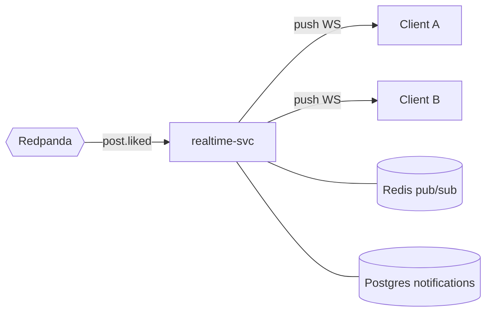

# realtime-svc (+ notifications)

> WebSocket gateway and real-time notifications.

| | |
|---|---|
| **Language** | Django (Channels) |
| **Stores** | Redis (pub/sub, channel layer) + Postgres (notifications) |
| **Sync dependencies** | none |
| **Authentication** | Keycloak JWT (at WS connect) |

## Responsibilities
- Maintain clients' WebSocket connections.
- Consume the bus and **push** updates to the right clients (live like counter, new story, notification).
- Persist and serve notifications.

## How it works

1. The client opens a `WS /ws` connection (JWT validated at the handshake).
2. It subscribes to logical channels: its `user_id`, the posts visible on screen.
3. realtime-svc consumes bus events and routes them to the relevant connections.

Django Channels' **channel layer** is backed by **Redis pub/sub** → it lets multiple realtime-svc instances share connections.



## Data model (Postgres)

```
notifications(
  id          UUID PK,
  user_id     UUID,
  type        TEXT,        -- like | comment | follow
  payload     JSONB,
  read        BOOLEAN,
  created_at  TIMESTAMPTZ
)
```

## API

| Method | Route | Description |
|---|---|---|
| `WS` | `/ws` | Real-time connection |
| `GET` | `/notifications` | The user's notifications |
| `POST` | `/notifications/{id}/read` | Mark as read |

## Events

**Emits:** —
**Consumes:** `post.liked`, `post.commented`, `story.created`, `user.followed`

## Notes
- For likes, the event carries `new_count` → push the counter directly without re-reading the database.
- Notifications are both **persisted** (notification center) and **pushed** live.
- Under high connection volume, scale horizontally (multiple instances + shared Redis channel layer).
